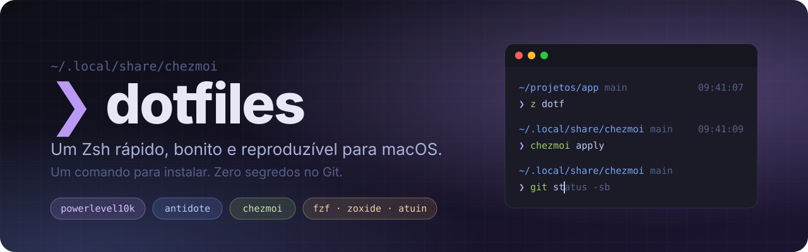
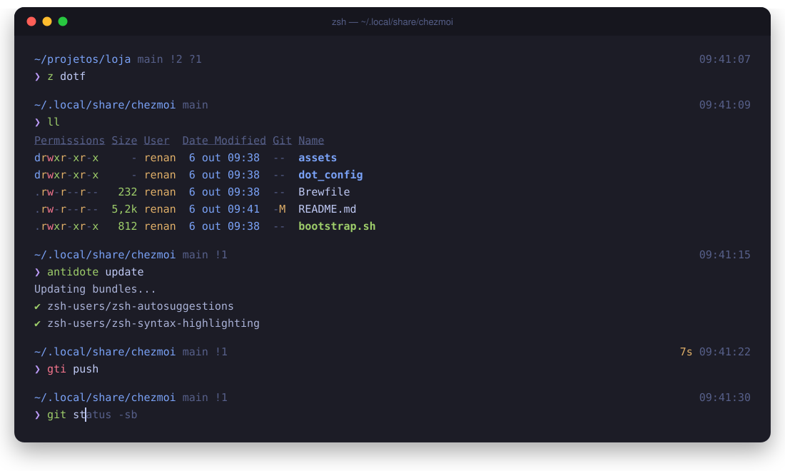

<p align="center">
  
</p>

<p align="center">
  
  
  
  
  
  <a href="LICENSE"></a>
</p>

<p align="center">
  <b>Abra o terminal e ele já está pronto.</b><br>
  Prompt instantâneo, sugestões enquanto você digita, navegação inteligente e um Mac novo configurado com um único comando.
</p>

<p align="center">
  <a href="#-instalação">Instalação</a> ·
  <a href="#-o-que-vem-na-caixa">O que vem na caixa</a> ·
  <a href="#%EF%B8%8F-atalhos-que-você-ganha">Atalhos</a> ·
  <a href="#-por-que-é-rápido">Desempenho</a> ·
  <a href="#-faça-o-seu">Faça o seu</a>
</p>

<br>

<p align="center">
  
</p>

## ✨ Por que usar

| | |
|---|---|
| ⚡ **Rápido de verdade** | Instant prompt do Powerlevel10k, bundle estático de plugins, `compinit` em cache e NVM sob demanda. O prompt aparece antes de qualquer coisa pesada carregar. |
| 🎨 **Bonito sem poluir** | Prompt minimalista de duas linhas no estilo Pure: diretório, branch, tempo de comandos lentos e hora. Nada além do que importa. |
| 🔁 **Reproduzível** | Um script instala Homebrew, ferramentas, fonte e dotfiles. Mac novo, mesmo terminal, em minutos. |
| 🔒 **Seguro para ser público** | Tokens e configurações da máquina ficam fora do Git, e o `doctor` avisa se algum segredo escapar. |
| 🧩 **Fácil de adaptar** | Plugins em um `.txt`, ferramentas em um `Brewfile`. Adicionar ou remover algo é uma linha. |

## 🚀 Instalação

Em um Mac novo, abra o Terminal e rode:

```bash
git clone https://github.com/renanloureiroo/dotfiles.git ~/.local/share/chezmoi
~/.local/share/chezmoi/bootstrap.sh
```

O `bootstrap.sh`:

1. instala o Homebrew, se ainda não existir;
2. instala tudo do [`Brewfile`](Brewfile), incluindo a MesloLGS Nerd Font;
3. faz backup dos seus dotfiles atuais em `~/.local/state/dotfiles-backup/`;
4. aplica a configuração com o Chezmoi.

Depois, selecione a fonte **MesloLGS NF** no seu terminal (Terminal, iTerm2, Warp, Ghostty…) e abra uma nova aba.

> [!TIP]
> No primeiro `git clone`, o macOS pode pedir para instalar as Command Line Tools. Aceite e rode o comando de novo.

## 📦 O que vem na caixa

| Categoria | Ferramenta | O que faz por você |
|---|---|---|
| Prompt | [Powerlevel10k](https://github.com/romkatv/powerlevel10k) | Prompt instantâneo com status do Git e tempo de execução |
| Plugins | [Antidote](https://antidote.sh/) | Gerenciador de plugins que gera um bundle estático e rápido |
| Dotfiles | [Chezmoi](https://www.chezmoi.io/) | Sincroniza a configuração entre Macs com diff antes de aplicar |
| Sugestões | zsh-autosuggestions | Completa o comando com base no seu histórico |
| Realce | zsh-syntax-highlighting | Comando válido em verde, inválido em vermelho, antes do Enter |
| Histórico | [atuin](https://atuin.sh/) | Busca no histórico com `Ctrl-R`, com contexto de diretório e duração |
| Navegação | [zoxide](https://github.com/ajeetdsouza/zoxide) | `z proj` leva você para o diretório que você mais usa |
| Busca | [fzf](https://github.com/junegunn/fzf) · [fd](https://github.com/sharkdp/fd) | Busca interativa (fzf) e um `find` moderno (fd) |
| Listagem | [eza](https://eza.rocks/) | `ls` com ícones, cores e status do Git |
| Leitura | [bat](https://github.com/sharkdp/bat) | `cat` com syntax highlighting |
| Extras | Oh My Zsh (só o necessário) | `git`, `extract`, `web-search` e `colored-man-pages`, sem carregar o framework inteiro |

## ⌨️ Atalhos que você ganha

| Atalho | Ação |
|---|---|
| `z <pedaço do nome>` | Pula para um diretório frequente |
| `ll` / `tree` | Lista detalhada com Git / árvore de diretórios |
| `Ctrl-R` | Busca no histórico com o atuin |
| `↑` / `↓` | Busca no histórico pelo que já foi digitado |
| `→` | Aceita a sugestão automática |
| `Ctrl-T` | Escolhe um arquivo com o fzf e cola no comando |
| `Alt-C` | Entra em um diretório escolhido com o fzf |
| `x arquivo.zip` | Extrai qualquer formato compactado |
| `gst`, `gco`, `gcmsg`, `gp` | Aliases do plugin `git` do Oh My Zsh |
| `reload` | Recarrega o shell |

## ⚡ Por que é rápido

- **Instant prompt:** o Powerlevel10k desenha o prompt antes do resto do `.zshrc` terminar.
- **Bundle estático:** o Antidote só regenera os plugins quando `dot_zsh_plugins.txt` muda.
- **`compinit` em cache:** a verificação completa das completions roda no máximo uma vez por dia.
- **NVM sob demanda:** o Node padrão já está no `PATH`, e o `nvm.sh` só carrega quando você chama `nvm`.
- **`.zshenv` enxuto:** sem comandos externos, para não atrasar scripts e subshells.

Meça na sua máquina:

```bash
~/.local/share/chezmoi/scripts/benchmark-shell
```

## 🔒 Segredos e configurações locais

Nada pessoal entra no repositório. Dois arquivos ficam só na sua máquina:

| Arquivo | Para quê |
|---|---|
| `~/.config/zsh/local.zsh` | Caminhos, variáveis e aliases específicos daquele Mac |
| `~/.zsh_secrets` (`chmod 600`) | Tokens e chaves de API |

```bash
cp ~/.config/zsh/local.example.zsh ~/.config/zsh/local.zsh
cp ~/.zsh_secrets.example ~/.zsh_secrets && chmod 600 ~/.zsh_secrets
```

O `scripts/doctor` confere as ferramentas instaladas e procura segredos versionados por engano.

## 🛠️ Uso diário

```bash
chezmoi cd          # entra no repositório
chezmoi diff        # mostra o que vai mudar
chezmoi apply       # aplica

brew bundle --file ~/.local/share/chezmoi/Brewfile   # atualiza ferramentas
antidote update                                      # atualiza plugins
```

## 🧬 Faça o seu

Gostou? Faça um fork e ajuste em poucos minutos:

- **Ferramentas:** edite o [`Brewfile`](Brewfile).
- **Plugins:** adicione ou remova linhas em [`dot_zsh_plugins.txt`](dot_zsh_plugins.txt).
- **Prompt:** mude cores e segmentos em [`dot_p10k.zsh`](dot_p10k.zsh) ou rode `p10k configure`.
- **Aliases:** os compartilhados ficam em [`dot_config/zsh/aliases.zsh`](dot_config/zsh/aliases.zsh); os pessoais, no seu `local.zsh`.

<details>
<summary><b>Estrutura do repositório</b></summary>

```text
.
├── bootstrap.sh                  # instalação em um comando
├── Brewfile                      # ferramentas e fonte
├── dot_zshenv                    # PATH mínimo, roda em todo processo zsh
├── dot_zprofile                  # Homebrew e shell de login
├── dot_zshrc                     # shell interativo
├── dot_p10k.zsh                  # tema do prompt
├── dot_zsh_plugins.txt           # lista de plugins do Antidote
├── dot_config/zsh/
│   ├── aliases.zsh
│   ├── tools.zsh                 # zoxide, fzf, atuin
│   └── local.example.zsh
├── private_dot_zsh_secrets.example
├── scripts/                      # doctor e benchmark-shell
└── docs/                         # instalação, plugins e solução de problemas
```

</details>

## 📚 Documentação

- [Instalação detalhada](docs/installation.md)
- [Plugins e ferramentas](docs/plugins.md)
- [Solução de problemas](docs/troubleshooting.md)

---

<p align="center">
  Feito com ☕ e muito <code>exec zsh</code> por <a href="https://github.com/renanloureiroo">@renanloureiroo</a>.<br>
  Se te ajudou, deixa uma ⭐. Distribuído sob a <a href="LICENSE">licença MIT</a>.
</p>
